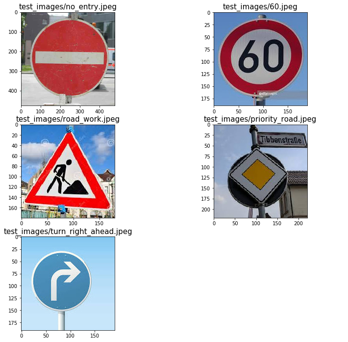

# Project: Build a Traffic Sign Recognition Classifier (by Andrey Shitov)
[](http://www.udacity.com/drive)

The goals / steps of this project are the following:
* Load the data set (see below for links to the project data set)
* Explore, summarize and visualize the data set
* Design, train and test a model architecture
* Use the model to make predictions on new images
* Analyze the softmax probabilities of the new images
* Summarize the results with a written report

## Step 0: Load The Data


```python
# Load pickled data
import pickle

training_file = "data/train.p"
validation_file= "data/valid.p"
testing_file = "data/test.p"

with open(training_file, mode='rb') as f:
    train = pickle.load(f)
with open(validation_file, mode='rb') as f:
    valid = pickle.load(f)
with open(testing_file, mode='rb') as f:
    test = pickle.load(f)

X_train, y_train = train['features'], train['labels']
X_valid, y_valid = valid['features'], valid['labels']
X_test, y_test = test['features'], test['labels']
```

## Step 1: Dataset Summary & Exploration

The pickled data is a dictionary with 4 key/value pairs:

- `'features'` is a 4D array containing raw pixel data of the traffic sign images, (num examples, width, height, channels).
- `'labels'` is a 1D array containing the label/class id of the traffic sign. The file `signnames.csv` contains id -> name mappings for each id.
- `'sizes'` is a list containing tuples, (width, height) representing the original width and height the image.
- `'coords'` is a list containing tuples, (x1, y1, x2, y2) representing coordinates of a bounding box around the sign in the image. **THESE COORDINATES ASSUME THE ORIGINAL IMAGE. THE PICKLED DATA CONTAINS RESIZED VERSIONS (32 by 32) OF THESE IMAGES**

### Provide a Basic Summary of the Data Set Using Python, Numpy and/or Pandas

I used the following code to calculate summary statistics of the traffic signs data set.


```python
import csv

### Replace each question mark with the appropriate value.
### Use python, pandas or numpy methods rather than hard coding the results

# TODO: Number of training examples
n_train = X_train.shape[0]

# TODO: Number of validation examples
n_validation = X_valid.shape[0]

# TODO: Number of testing examples.
n_test = X_test.shape[0]

# TODO: What's the shape of an traffic sign image?
image_shape = X_train.shape[1:3]

# TODO: How many unique classes/labels there are in the dataset.
n_classes = 0
with open('signnames.csv') as f:
    signnamesObj = csv.reader(f)
    n_classes = sum(1 for row in signnamesObj)
    n_classes -= 1 # header row


print("Number of training examples =", n_train)
print("Number of validation examples =", n_validation)
print("Number of testing examples =", n_test)
print("Image data shape =", image_shape)
print("Number of classes =", n_classes)
```

    Number of training examples = 34799
    Number of validation examples = 4410
    Number of testing examples = 12630
    Image data shape = (32, 32)
    Number of classes = 43


### Include an exploratory visualization of the dataset
Here is an exploratory visualization of the data set. One sign of each category is shown (the one with mean value of color channgels closest to 128). Also number of signs in each category is shown. I see that some categories have less than 500 samples, therefore in next sections I generate augmented data for these categories.


```python
### Data exploration visualization code goes here.
### Feel free to use as many code cells as needed.
import matplotlib.pyplot as plt
import numpy as np
# Visualizations will be shown in the notebook.
%matplotlib inline

from __future__ import division
from matplotlib import colors as mcolors

with open('signnames.csv') as csvfile:
    data = list(csv.reader(csvfile))
    data.pop(0)

names = [x[1] for x in data]
count = [0] * n_classes
examples = [None] * n_classes
brightness = [0] * n_classes

BR = 128.0
for x, l in zip(X_train, y_train):
    count[l] += 1
    br = np.mean(x)
    if abs(br - BR) < abs(brightness[l] - BR):
        examples[l] = x
        brightness[l] = br

ncols = 3
nrows = n_classes // ncols + 1
fig, axes = plt.subplots(nrows, ncols, figsize=(12, 24), subplot_kw={'xticks': [], 'yticks': []})
fig.subplots_adjust(hspace=0.8, wspace=2.2)

i = 0
for name, ax in zip(names, axes.flat):
    ax.imshow(examples[i])
    ax.set_title(name + " [" + str(count[i]) + "]")
    i += 1

```


----

## Step 2: Design and Test a Model Architecture

In this step a deep learning model that learns to recognize traffic signs is designed and implemented. The [German Traffic Sign Dataset](http://benchmark.ini.rub.de/?section=gtsrb&subsection=dataset) is used for training and testing.

The LeNet-5 implementation shown in the [classroom](https://classroom.udacity.com/nanodegrees/nd013/parts/fbf77062-5703-404e-b60c-95b78b2f3f9e/modules/6df7ae49-c61c-4bb2-a23e-6527e69209ec/lessons/601ae704-1035-4287-8b11-e2c2716217ad/concepts/d4aca031-508f-4e0b-b493-e7b706120f81) at the end of the CNN lesson was used as a starting point.

### Augment data set

When you walk in the street, you can see traffic signs from different angles, so I decided to use perspective transformation technique as a "natural" way of data augmentation. Four points, which form a square, are chosen as original points for perspective transform. Another four points, which correspond to new locations of original points in new perspective, are randomly generated. By passing these source and destination points to `cv2.getPerspectiveTransform` function, I calcualte transformation matrix, which is used to augment original images.

The code below defines function `transform_image` which randomly transforms an image. The result of launching this function 100 times for an image from data set is shown below.


```python
import random
import matplotlib as mp
import cv2

def calc_persp_matr(src_corners, dst_corners):
    src = np.float32(src_corners)
    dst = np.float32(dst_corners)
    m = cv2.getPerspectiveTransform(src, dst)
    m_inv = cv2.getPerspectiveTransform(dst, src)
    return m, m_inv

def transform_image(img):
    src = [[5, 5], [26, 5], [5, 26], [26, 26]]
    dst = [[random.randint(0, 10), random.randint(0, 10)],
           [random.randint(22, 32), random.randint(0, 10)],
           [random.randint(0, 10), random.randint(22, 32)],
           [random.randint(22, 32), random.randint(22, 32)]]
    m, m_inv = calc_persp_matr(src, dst)
    warped = np.copy(img)
    for ind in range(3):
        warped[:,:,ind] = cv2.warpPerspective(img[:,:,ind],
                                              m,
                                              (img.shape[1], img.shape[0]),
                                              flags=cv2.INTER_LINEAR)
    return warped

img = X_train[500]

gs1 = mp.gridspec.GridSpec(10, 10)
gs1.update(wspace=0.01, hspace=0.02) # set the spacing between axes.
plt.figure(figsize=(12,12))
for i in range(100):
    ax1 = plt.subplot(gs1[i])
    ax1.set_xticklabels([])
    ax1.set_yticklabels([])
    ax1.set_aspect('equal')
    tr = transform_image(img)

    plt.subplot(10, 10,i+1)
    plt.imshow(tr)
    plt.axis('off')

plt.show()
```


I generate augmented images only generated for those classes, which contain less than 500 samples. For each image in such class, 2 augmented samples are generated. After running the following cell, the training set size increases from 34799 to 46919 samples.


```python
import log_progress as lp

X_train_ext = np.empty((0, 32, 32, 3), dtype=np.uint8)
y_train_ext = np.empty((0), dtype=np.uint8)
i = 0
for im in lp.log_progress(X_train):
    X_train_ext = np.append(X_train_ext, [im], axis = 0)
    y_train_ext = np.append(y_train_ext, y_train[i])
    if (count[y_train[i]] < 500):
        for j in range(2):
            X_train_ext = np.append(X_train_ext, [transform_image(im)], axis = 0)
            y_train_ext = np.append(y_train_ext, y_train[i])
    i += 1

print(X_train.shape)
print(X_train_ext.shape)
```

    Widget Javascript not detected.  It may not be installed properly. Did you enable the widgetsnbextension? If not, then run "jupyter nbextension enable --py --sys-prefix widgetsnbextension"


    (34799, 32, 32, 3)
    (46919, 32, 32, 3)


### Pre-process the image data (normalization, grayscale, etc.)

To pre-process the image data two steps are applied:

1. Normalize image brightness by applying [CLAHE](https://docs.opencv.org/3.1.0/d5/daf/tutorial_py_histogram_equalization.html) normalization to the L channel in LAB representation of the image
2. Normalize pixel values using suggested `(pixel - 128)/ 128` formula

Function `preprocess` performs these steps.


```python
from sklearn.utils import shuffle
import cv2

### Preprocess the data here. It is required to normalize the data. Other preprocessing steps could include
### converting to grayscale, etc.
### Feel free to use as many code cells as needed.

def preprocess(image, clip_limit=3):
    # convert image to LAB color model
    image_lab = cv2.cvtColor(image, cv2.COLOR_RGB2LAB)

    # split the image into L, A, and B channels
    l_channel, a_channel, b_channel = cv2.split(image_lab)

    # apply CLAHE to lightness channel
    clahe = cv2.createCLAHE(clipLimit=clip_limit, tileGridSize=(8, 8))
    cl = clahe.apply(l_channel)

    # merge the CLAHE enhanced L channel with the original A and B channel
    merged_channels = cv2.merge((cl, a_channel, b_channel))

    # convert iamge from LAB color model back to RGB color model
    final_image = cv2.cvtColor(merged_channels, cv2.COLOR_LAB2RGB)
    return (final_image.astype(np.float32) - 128) / 128

X_train_norm = np.copy(X_train_ext).astype(np.float32)
for i, im in enumerate(X_train_ext):
    X_train_norm[i] = preprocess(im)

X_valid_norm = np.copy(X_valid).astype(np.float32)
for i, im in enumerate(X_valid):
    X_valid_norm[i] = preprocess(im)

X_test_norm = np.copy(X_test).astype(np.float32)
for i, im in enumerate(X_test):
    X_test_norm[i] = preprocess(im)

X_train_prep = X_train_norm
X_valid_prep = X_valid_norm
X_test_prep = X_test_norm
y_train_prep = y_train_ext
```

### Model Architecture

| Layer         		| Output   |    Description	    |
|:---------------------:|:--------:|:------------------:|
| Input         		| -        | 32x32x3 RGB image as input	|
| Convolution 1x1x3     | 32x32x1  | -             	    |
| Relu                  | -        | -                  |
| Convolution 5x5x1		| 28x28x16 | 16 filters         |
| Relu                  | -        | -                  |
| Max pooling	      	| 14x14x16 | 2x2 stride         |
| Dropout               | 14x14x16 |                    |
| Convolution 3x3x16    | 12x12x32 | 32 filters         |
| Relu                  | -        | -                  |
| Max pooling	      	| 6x6x32   | 2x2 stride         |
| Convolution 3x3x32    | 4x4x64   | 64 filters         |
| Relu                  | -        | -                  |
| Max pooling	      	| 2x2x64   | 2x2 stride         |
| Fully connected		| 120      | Input size: 256    |
| Relu                  | -        | -                  |
| Dropout               | 14x14x16 | -                  |
| Fully connected		| 84       | -                  |
| Relu                  | -        | -                  |
| Fully connected		| 43       | -                  |
| Softmax				| 43       | -                  |

Comparing to the LeNet CNN, I've made the following changes:

- Added initial 1x1x3 layer. The idea of it is to allow NN to choose itslef best way of color channels combination instead of graying the image.
- Added one more convolution and fully connected layer - to reduce bias.
- Increased number of filters in each convolution layer - to reudce bias.
- Added two dropout layers - to reduce variance.

The history how I improved the network is represented by commit history:
```
git log --pretty=format:"%ad %s" --graph

* Wed Sep 26 01:39:57 2018 +0300 Completed project. Reached more than 98% accuracy on validation set.
* Tue Sep 25 18:29:01 2018 +0300 Set keep_prob separately for training and evaluation.
* Mon Sep 24 23:59:04 2018 +0300 Add convolutional layer and two dropout layers.
* Mon Sep 24 09:43:09 2018 +0300 Add 1x1x3 convolution layer.
* Sun Sep 23 19:29:29 2018 +0300 Add simple normalization.
* Sun Sep 23 19:23:29 2018 +0300 Add LeNet NN implementation.
```

The commit "Completed project. Reached more than 98% accuracy on validation set." add data augmentation and CLAHE normalization.


```python
import tensorflow as tf
from tensorflow.contrib.layers import flatten

def conv2d(x, W, b, strides=1):
    x = tf.nn.conv2d(x, W, strides=[1, strides, strides, 1], padding='VALID') + b
    return tf.nn.relu(x)

def maxpool2d(x, k=2):
    return tf.nn.max_pool(x, ksize=[1, k, k, 1], strides=[1, k, k, 1], padding='VALID')

def SignNet(x, keep_prob):    
    # Arguments used for tf.truncated_normal, randomly defines variables for the weights and biases for each layer
    mu = 0
    sigma = 0.1

    weights = {
        'wc0': tf.Variable(tf.truncated_normal(shape=(1, 1, 3, 1), mean = mu, stddev = sigma, seed = 0)),
        'wc1': tf.Variable(tf.truncated_normal(shape=(5, 5, 1, 16), mean = mu, stddev = sigma, seed = 1)),
        'wc2': tf.Variable(tf.truncated_normal(shape=(3, 3, 16, 32), mean = mu, stddev = sigma, seed = 2)),
        'wc3': tf.Variable(tf.truncated_normal(shape=(3, 3, 32, 64), mean = mu, stddev = sigma, seed = 3)),
        'wd1': tf.Variable(tf.truncated_normal(shape=(256, 120), mean = mu, stddev = sigma, seed = 4)),
        'wd2': tf.Variable(tf.truncated_normal(shape=(120, 84), mean = mu, stddev = sigma, seed = 5)),
        'wd3': tf.Variable(tf.truncated_normal(shape=(84, n_classes), mean = mu, stddev = sigma, seed = 6))}

    biases = {
        'bc0': tf.Variable(tf.zeros(1)),
        'bc1': tf.Variable(tf.zeros(16)),
        'bc2': tf.Variable(tf.zeros(32)),
        'bc3': tf.Variable(tf.zeros(64)),
        'bd1': tf.Variable(tf.zeros(120)),
        'bd2': tf.Variable(tf.zeros(84)),
        'bd3': tf.Variable(tf.zeros(n_classes))}

    # Layer 0: Convolutional. Input = 32x32x3. Output = 32x32x1.
    conv0 = conv2d(x, weights['wc0'], biases['bc0'])

    # Layer 1: Convolutional. Input = 32x32x1. Output = 28x28x16.
    conv1 = conv2d(conv0, weights['wc1'], biases['bc1'])
    # Pooling. Input = 28x28x16. Output = 14x14x16.
    pool1 = maxpool2d(conv1)
    drop1 = tf.nn.dropout(pool1, keep_prob)

    # Layer 2: Convolutional. Output = 12x12x32.
    conv2 = conv2d(drop1, weights['wc2'], biases['bc2'])
    # Pooling. Output = 6x6x32.
    pool2 = maxpool2d(conv2)

    # Layer 3: Convolutional. Output = 4x4x64.
    conv3 = conv2d(pool2, weights['wc3'], biases['bc3'])
    # Pooling. Output = 2x2x64.
    pool3 = maxpool2d(conv3)

    # Flatten. Output = 256.
    fc1 = flatten(pool3)

    # Layer 4: Fully Connected. Input = 256. Output = 120.
    fc1 = tf.matmul(fc1, weights['wd1']) + biases['bd1']
    fc1 = tf.nn.relu(fc1)
    fc1 = tf.nn.dropout(fc1, keep_prob)

    # Layer 5: Fully Connected. Input = 120. Output = 84.
    fc2 = tf.matmul(fc1, weights['wd2']) + biases['bd2']
    fc2 = tf.nn.relu(fc2)

    # Layer 6: Fully Connected. Input = 84. Output = n_classes.
    out = tf.matmul(fc2, weights['wd3']) + biases['bd3']

    return out, conv1, conv2, conv3
```

### Train, Validate and Test the Model
To reduce bias, I've increased number of epochs to 200, the rest of the code looks almost like in LeNet lab.


```python
### Train your model here.
### Calculate and report the accuracy on the training and validation set.
### Once a final model architecture is selected,
### the accuracy on the test set should be calculated and reported as well.
### Feel free to use as many code cells as needed.

X_train_pr = np.copy(X_train_prep)
X_valid_pr = np.copy(X_valid_prep)
X_test_pr =  np.copy(X_test_prep)
y_train_pr = np.copy(y_train_prep)
y_valid_pr = np.copy(y_valid)
y_test_pr = np.copy(y_test)

assert(X_train_pr.all() == X_train.all())

EPOCHS = 200
BATCH_SIZE = 128
rate = 0.001

tf.reset_default_graph()
tf.set_random_seed(1)
np.random.seed(1)

x = tf.placeholder(tf.float32, (None, 32, 32, 3))
y = tf.placeholder(tf.int32, (None))
keep_prob = tf.placeholder(tf.float32)

one_hot_y = tf.one_hot(y, n_classes)

logits, conv1, conv2, conv3 = SignNet(x, keep_prob)
cross_entropy = tf.nn.softmax_cross_entropy_with_logits(labels=one_hot_y, logits=logits)
loss_operation = tf.reduce_mean(cross_entropy)
optimizer = tf.train.AdamOptimizer(learning_rate = rate)
training_operation = optimizer.minimize(loss_operation)

correct_prediction = tf.equal(tf.argmax(logits, 1), tf.argmax(one_hot_y, 1))
accuracy_operation = tf.reduce_mean(tf.cast(correct_prediction, tf.float32))
saver = tf.train.Saver()

def evaluate(X_data, y_data):
    num_examples = len(X_data)
    total_accuracy = 0
    sess = tf.get_default_session()
    for offset in range(0, num_examples, BATCH_SIZE):
        batch_x, batch_y = X_data[offset:offset+BATCH_SIZE], y_data[offset:offset+BATCH_SIZE]
        accuracy = sess.run(accuracy_operation, feed_dict={x: batch_x, y: batch_y, keep_prob: 1.0})
        total_accuracy += (accuracy * len(batch_x))
    return total_accuracy / num_examples

with tf.Session() as sess:   
    sess.run(tf.global_variables_initializer())
    num_examples = len(X_train_pr)

    print("Training...")
    print()
    for i in range(EPOCHS):
        X_train_pr, y_train_pr = shuffle(X_train_pr, y_train_pr, random_state=1)
        for offset in range(0, num_examples, BATCH_SIZE):
            end = offset + BATCH_SIZE
            batch_x, batch_y = X_train_pr[offset:end], y_train_pr[offset:end]
            sess.run(training_operation, feed_dict={x: batch_x, y: batch_y, keep_prob: 0.5})

        validation_accuracy = evaluate(X_valid_pr, y_valid_pr)
        train_accuracy = evaluate(X_train_pr, y_train_pr)

        if (i + 1) % 10 == 0:
            print("EPOCH {} ...".format(i+1))
            print("Train Accuracy = {:.3f}".format(train_accuracy))
            print("Validation Accuracy = {:.3f}".format(validation_accuracy))
            print()

    saver.save(sess, './signnet')
    print("Model saved")
```

    WARNING:tensorflow:From <ipython-input-8-a1b66e246861>:31: softmax_cross_entropy_with_logits (from tensorflow.python.ops.nn_ops) is deprecated and will be removed in a future version.
    Instructions for updating:

    Future major versions of TensorFlow will allow gradients to flow
    into the labels input on backprop by default.

    See @{tf.nn.softmax_cross_entropy_with_logits_v2}.

    Training...

    EPOCH 10 ...
    Train Accuracy = 0.938
    Validation Accuracy = 0.960

    EPOCH 20 ...
    Train Accuracy = 0.970
    Validation Accuracy = 0.975

    EPOCH 30 ...
    Train Accuracy = 0.981
    Validation Accuracy = 0.977

    EPOCH 40 ...
    Train Accuracy = 0.985
    Validation Accuracy = 0.977

    EPOCH 50 ...
    Train Accuracy = 0.988
    Validation Accuracy = 0.980

    EPOCH 60 ...
    Train Accuracy = 0.991
    Validation Accuracy = 0.977

    EPOCH 70 ...
    Train Accuracy = 0.992
    Validation Accuracy = 0.984

    EPOCH 80 ...
    Train Accuracy = 0.994
    Validation Accuracy = 0.983

    EPOCH 90 ...
    Train Accuracy = 0.994
    Validation Accuracy = 0.983

    EPOCH 100 ...
    Train Accuracy = 0.994
    Validation Accuracy = 0.977

    EPOCH 110 ...
    Train Accuracy = 0.995
    Validation Accuracy = 0.982

    EPOCH 120 ...
    Train Accuracy = 0.996
    Validation Accuracy = 0.982

    EPOCH 130 ...
    Train Accuracy = 0.996
    Validation Accuracy = 0.979

    EPOCH 140 ...
    Train Accuracy = 0.995
    Validation Accuracy = 0.984

    EPOCH 150 ...
    Train Accuracy = 0.996
    Validation Accuracy = 0.981

    EPOCH 160 ...
    Train Accuracy = 0.997
    Validation Accuracy = 0.983

    EPOCH 170 ...
    Train Accuracy = 0.996
    Validation Accuracy = 0.984

    EPOCH 180 ...
    Train Accuracy = 0.996
    Validation Accuracy = 0.981

    EPOCH 190 ...
    Train Accuracy = 0.998
    Validation Accuracy = 0.987

    EPOCH 200 ...
    Train Accuracy = 0.997
    Validation Accuracy = 0.986

    Model saved


```python
### Calculate the accuracy for the Test set
saver = tf.train.Saver()
with tf.Session() as sess:
    saver.restore(sess, './signnet')
    test_acc = evaluate(X_test_pr, y_test_pr)

    print("Test Accuracy = {:.3f}".format(test_acc))
```

    INFO:tensorflow:Restoring parameters from ./signnet
    Test Accuracy = 0.965


## Step 3: Test a Model on New Images

Five additonal images were loaded to the test_images folder. They are square, but their size is bigger than 32x32, therefore additional preprocessing is required.

### Load and Output the Images
The code below preprocesses images so that they become a valid input for my CNN. Two arrays: `x_new_images` and `y_new_images`, containing preprocessed image data for CNN and image labels are generated.


```python
### Load the images and plot them here.
### Feel free to use as many code cells as needed.

import glob
import matplotlib.pyplot as plt
import cv2
import os

### Load the images and plot them here.
### Feel free to use as many code cells as needed.
# Make a list of images
images= ['test_images/no_entry.jpeg',
         'test_images/60.jpeg',
         'test_images/road_work.jpeg',
         'test_images/priority_road.jpeg',
         'test_images/turn_right_ahead.jpeg']
images_count = len(images)

fig, ax = plt.subplots(int((images_count + 1) / 2), 2, figsize=(10, 10))
x_new_images = np.empty((0, 32, 32, 3), dtype=np.float32)
y_new_images = np.array([17, 3, 25, 12, 33])
for idx, fname in enumerate(images):
    t_img = cv2.imread(fname)
    t_img = cv2.cvtColor(t_img, cv2.COLOR_BGR2RGB)

    pr_img = preprocess(cv2.resize(t_img, (32, 32), interpolation = cv2.INTER_AREA))
    x_new_images = np.append(x_new_images, [pr_img], axis = 0)

    # plot original and final image
    row = int(idx / 2)
    col = idx % 2
    ax[row, col].set_title(fname, fontsize=15)
    ax[row, col].imshow(t_img)
    ax[row, col].set_aspect('equal')

plt.subplots_adjust(left=0., right=1, top=0.9, bottom=0.)
plt.axis('off')
```


    (0.0, 1.0, 0.0, 1.0)





### Predict the Sign Type for Each Image

Prediction accuracy for selected images is 100%.


```python
### Run the predictions here and use the model to output the prediction for each image.
### Make sure to pre-process the images with the same pre-processing pipeline used earlier.
### Feel free to use as many code cells as needed.

saver = tf.train.Saver()
with tf.Session() as sess:
    saver.restore(sess, './signnet')
    lgts = sess.run(logits, feed_dict={x: x_new_images, keep_prob: 1.0})
    for i, img in enumerate(x_new_images):
        recognized_id = np.argmax(lgts[i])
        print("Image: \"" + images[i] + "\" recognized as \"" + names[recognized_id] + "\"")
```

    INFO:tensorflow:Restoring parameters from ./signnet
    Image: "test_images/no_entry.jpeg" recognized as "No entry"
    Image: "test_images/60.jpeg" recognized as "Speed limit (60km/h)"
    Image: "test_images/road_work.jpeg" recognized as "Road work"
    Image: "test_images/priority_road.jpeg" recognized as "Priority road"
    Image: "test_images/turn_right_ahead.jpeg" recognized as "Turn right ahead"


### Analyze Performance


```python
### Calculate the accuracy for these 5 new images.
### For example, if the model predicted 1 out of 5 signs correctly, it's 20% accurate on these new images.

saver = tf.train.Saver()
with tf.Session() as sess:
    saver.restore(sess, './signnet')
    new_image_acc = evaluate(x_new_images, y_new_images)
    print("New Images Accuracy = {:.3f}".format(new_image_acc))
```

    INFO:tensorflow:Restoring parameters from ./signnet
    New Images Accuracy = 1.000


### Output Top 5 Softmax Probabilities For Each Image Found on the Web

Looking at softmax probabilities, we can say that model predicts really good for selected images. The largest probabilty is always almost 100%.


```python
### Print out the top five softmax probabilities for the predictions on the German traffic sign images found on the web.
### Feel free to use as many code cells as needed.

saver = tf.train.Saver()
with tf.Session() as sess:
    saver.restore(sess, './signnet')
    top5 = sess.run(tf.nn.top_k(tf.nn.softmax(logits), k=5), feed_dict={x: x_new_images, keep_prob: 1.0})
    np.set_printoptions(formatter={'float_kind':lambda x: "%.3f" % x})
    print("Top5 Softmax probabilities for each image:")
    print(top5.values)
    print("\nTop5 corresponding indices:")
    print(top5.indices)
```

    INFO:tensorflow:Restoring parameters from ./signnet
    Top5 Softmax probabilities for each image:
    [[1.000 0.000 0.000 0.000 0.000]
     [0.997 0.001 0.001 0.001 0.000]
     [1.000 0.000 0.000 0.000 0.000]
     [1.000 0.000 0.000 0.000 0.000]
     [0.985 0.015 0.000 0.000 0.000]]

    Top5 corresponding indices:
    [[17 34 38 37 14]
     [ 3  5  2  0  1]
     [25 22 29 30 24]
     [12 40 34 35 17]
     [33 35 34 15  3]]


---

## Step 4 (Optional): Visualize the Neural Network's State with Test Images

 This Section is not required to complete but acts as an additional excersise for understaning the output of a neural network's weights. While neural networks can be a great learning device they are often referred to as a black box. We can understand what the weights of a neural network look like better by plotting their feature maps. After successfully training your neural network you can see what it's feature maps look like by plotting the output of the network's weight layers in response to a test stimuli image. From these plotted feature maps, it's possible to see what characteristics of an image the network finds interesting. For a sign, maybe the inner network feature maps react with high activation to the sign's boundary outline or to the contrast in the sign's painted symbol.

 Provided for you below is the function code that allows you to get the visualization output of any tensorflow weight layer you want. The inputs to the function should be a stimuli image, one used during training or a new one you provided, and then the tensorflow variable name that represents the layer's state during the training process, for instance if you wanted to see what the [LeNet lab's](https://classroom.udacity.com/nanodegrees/nd013/parts/fbf77062-5703-404e-b60c-95b78b2f3f9e/modules/6df7ae49-c61c-4bb2-a23e-6527e69209ec/lessons/601ae704-1035-4287-8b11-e2c2716217ad/concepts/d4aca031-508f-4e0b-b493-e7b706120f81) feature maps looked like for it's second convolutional layer you could enter conv2 as the tf_activation variable.

For an example of what feature map outputs look like, check out NVIDIA's results in their paper [End-to-End Deep Learning for Self-Driving Cars](https://devblogs.nvidia.com/parallelforall/deep-learning-self-driving-cars/) in the section Visualization of internal CNN State. NVIDIA was able to show that their network's inner weights had high activations to road boundary lines by comparing feature maps from an image with a clear path to one without. Try experimenting with a similar test to show that your trained network's weights are looking for interesting features, whether it's looking at differences in feature maps from images with or without a sign, or even what feature maps look like in a trained network vs a completely untrained one on the same sign image.

<figure>
 
 <figcaption>
 <p></p>
 <p style="text-align: center;"> Your output should look something like this (above)</p>
 </figcaption>
</figure>
 <p></p>


```python
### Visualize your network's feature maps here.
### Feel free to use as many code cells as needed.

# image_input: the test image being fed into the network to produce the feature maps
# tf_activation: should be a tf variable name used during your training procedure that represents the calculated state of a specific weight layer
# activation_min/max: can be used to view the activation contrast in more detail, by default matplot sets min and max to the actual min and max values of the output
# plt_num: used to plot out multiple different weight feature map sets on the same block, just extend the plt number for each new feature map entry

def outputFeatureMap(image_input, tf_activation, activation_min=-1, activation_max=-1 ,plt_num=1):
    # Here make sure to preprocess your image_input in a way your network expects
    # with size, normalization, ect if needed
    # image_input =
    # Note: x should be the same name as your network's tensorflow data placeholder variable
    # If you get an error tf_activation is not defined it may be having trouble accessing the variable from inside a function
    activation = tf_activation.eval(session=sess,feed_dict={x : image_input, keep_prob: 1.0})
    featuremaps = activation.shape[3]
    plt.figure(plt_num, figsize=(15,15))
    for featuremap in range(featuremaps):
        plt.subplot(6,8, featuremap+1) # sets the number of feature maps to show on each row and column
        plt.title('FeatureMap ' + str(featuremap)) # displays the feature map number
        if activation_min != -1 & activation_max != -1:
            plt.imshow(activation[0,:,:, featuremap], interpolation="nearest", vmin =activation_min, vmax=activation_max, cmap="gray")
        elif activation_max != -1:
            plt.imshow(activation[0,:,:, featuremap], interpolation="nearest", vmax=activation_max, cmap="gray")
        elif activation_min !=-1:
            plt.imshow(activation[0,:,:, featuremap], interpolation="nearest", vmin=activation_min, cmap="gray")
        else:
            plt.imshow(activation[0,:,:, featuremap], interpolation="nearest", cmap="gray")

saver = tf.train.Saver()
with tf.Session() as sess:
    saver.restore(sess, './signnet')
    outputFeatureMap(x_new_images[0:1], conv1)

```

    INFO:tensorflow:Restoring parameters from ./signnet


```python
saver = tf.train.Saver()
with tf.Session() as sess:
    saver.restore(sess, './signnet')
    outputFeatureMap(x_new_images[1:2], conv2)
```

    INFO:tensorflow:Restoring parameters from ./signnet


